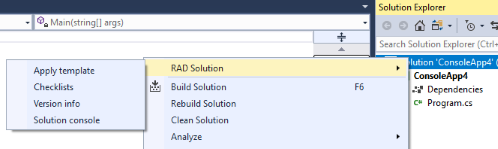
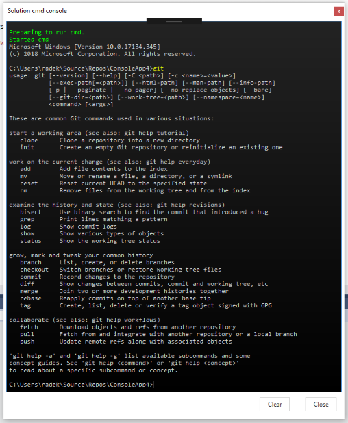

# RAD Projects Extension #
RAD Projects Extension is an extension for Visual Studio 2017 supporting the "operations" work with my (RAD) projects (mostly .Net Core last years). Its implementation also demonstrates some patterns/ways used in VSIX development.

I have created the VS extension to make work with my project more productive, simple and less prone to human errors. This is the main functionality it helps me with:

- **[Solution (Project) Templates](#solution-project-templates)** allow to extend the existing solution with the common files and helper projects I use mainly for building, versioning and packaging. The template is much easier to create than the VS multi-projects template (what is still quite a challenge in case you want to have the Solution items part of the template) and the template can be re-apllied (updated) any time when needed.
- [Solution Console](#solution-console) is command line console implementation that allows to do the command line activities within the context (working directory) of opened solution. Actually this is just the side effect of custom implemented console control used with the checklists (see below)
- [Version Dialog](#version-dialog) allows me to simply check and update the version information stored in `Version.props` file. I use this file to share the current version information across all projects within the solution to apply proper version to the assemblies and NuGet packages.
- **[Checklists](#checklists)** is probably the most interesting functionality. In general, it allows to create (and reuse if part of [template](#solution-project-templates)) checklists with manual and/or automated (CLI) steps that are executed and tracked during the development process. I use it mainly as a part of release process, but it can cover virtually any process.    


I don't publish the extension at the Marketplace at the end, as it's bound to specifics of my way of work, but feel free to build your own extension, use any part of it or simply just get inspired (some **[hints](#vsix-implementation-hints)** are at the end of this document)...

*Note: The implementation of console is based on code from [https://github.com/dwmkerr/consolecontrol](https://github.com/dwmkerr/consolecontrol). Some parts have been redesigned/rewritten as I could not make it working in WPF. The details will be provided in related [issue ticket](https://github.com/dwmkerr/consolecontrol/issues/25). The console control implemented in this VSIX extension can be "extracted" from code and used in any WPF applications, you just need to get the console's control (XAML+.cs), `ProcessWrapper` and their dependencies (usings)* 


## Solution (Project) Templates ##
I use some common "operation" patterns with my projects including the extension of MSBuild process, versioning, package publishing, etc. This is done by adding some "technical" build projects (not being build into the output assemblies), property files, etc. This means that such projects, solution files and some solution settings need to be "replicated" across the solutions with the possibility to update from template later on.
The VS templating can be used when creating the new project, but it's hard to update later on. Also the VSIX is needed to handle the solution based files (incl. Solution Items).
Using NuGet packages might be a way, how to manage the updates, but there is some overhead needed to build and maintain the packages.

### How do the templates work in RAD Project Extension ###    
I have a directory with templates, where template is actually a VS solution that can live on its own, be versioned in GIT, etc. Such solution is used to design/implement, test and debug the template and the functionality it provides.
The sample template here is used to manage the build process of my projects. It provides two projects - `build` with MSBuild definitions (tasks, targets, props) and `build.tasks` with implementation of custom build tasks. It also provides some common solution files (for license file) or the files to be added to the solution, but not to be updated later on from template (for example readme file).


Template is applied to the target solution using the `Apply template` command available at `RAD Solution` submenu extending the VS context menu of the solution root.



The extension looks for templates in the directory containing the templates, that is defined in extension options that are a part of VS settings dialog.


The template directory setting can contain some variables that are replaced by proper values when executed
- `%Projects%` - VS default projects directory
- `%MyDocuments%` - My Documents directory of current user
- `%UserProfile%` - User profile  directory of current user

The default value is `%Projects%\Template`.

In case there is just one template available, it's applied to the target solution. Otherwise it's necessary to choose a template from the list


*Note: when re-applying the template, the last template applied is used automatically*

When the template is applied to the target solution, the files are copied to the solution directory, the projects are added to solution as well as the solution items.
- **Add projects from template** - all template subdirs containing the `.csproj` file are recognized as a project, copied to target solution and added to the solution. The subdirs starting with dot (`.`) are automatically excluded. When the project exists in target solution, the files are copied (replaced if needed), but the project is not being added to the target solution as already exists there. *Note: The Net Core projects don't need the update of project files in case that the files are added/removed to/from project*
- **Add solution items from template** - all files from the root dir of template (except `.sln`) are copied to target solution directory and added to the target solution as solution items if not excluded (see below). When the target solution contains given solution item, it's not added anymore, just the file is being replaced (if not forbidden - see below)
- **Remove the files at target solution** - it's possible that during the template evolution, some files become obsolete and are to be removed from the target solution. These files are described in template definition (`template.json`) and are removed from target solution/projects. *Note: I have some issue when removing the file from solution items, so if there is an error, the warning is raised and the file is to be removed from solution items manually (the file itself is deleted from file system without any problems).*
- **Adjust the build dependencies of target solution** - the template allows to define the build dependencies to be applied to the target solution. For example, I want to have all projects, but `build.tasks`, dependent on `build` project to ensure correct behavior of my build process. *Note: Keep in mind, that build dependency is just a way how to manage the build order of solution in VS and is not the project reference.* 

The behavior is adjusted in template's `template.json` file
```json
{
  "name": "RAD .net Core solution",
  "doNotOverwriteFileNames": ["Version.props","Directory.Build.props","readme.md","changelog.md"],
  "doNotAddToSolutionFileNames": [".gitattributes",".gitignore","template.json"],
  "removeFileNames": ["template.json.bak","build\\Git - Copy.targets"],
  "buildDependencies":[{project:"*-build.tasks", dependsOn:"build"}]
}
```
- **name** is the name of the template
- **doNotOverwriteFileNames** defines the set of file names that will be added from template to target if not exist, but will not be overwritten by template in case they already exist (even if the template has been updated and/or re-applied). The exclusion is based on file name regardless the location of the file, so all the files with the same name will not be replaced even if there are more files having the same name in different projects/locations.
- **doNotAddToSolutionFileNames** defines the set of files that will be copied to the target solution dir (if presented in template, of course), but will not be added to the solution items of the target solution.
- **removeFileNames** defines the set of files to be removed from the target solution if needed. In this case the path relative to the target solution dir needs to be specified for each file. When the target file doesn't exist, the remove files entry is simply ignored.
- **buildDependencies** allows to adjust the build order of the target solution. It set's the build dependency where specified project(s) depends on another one. `dependsOn` entry is the name of required project (ignored if doesn't exist in target solution). `project` can be individual project or set of projects:
  - `project:"build.tasks"` - the dependency for `build.tasks` project will be set
  - `project:"build,build.tasks"` - the dependency for `build` and `build.tasks` projects will be set. It's the list of projects separated by comma
  - `project:"*"` - the dependency for all projects in the solution will be set
  - `project:"*-build.tasks"` - the dependency for all projects in the solution but `build.tasks` will be set
  - `project:"*-build,build.tasks"` - the dependency for all projects in the solution but `build` and `build.tasks` will be set. The exclusions are defined as the list of projects separated by comma
  - *Note: when any of listed projects doesn't exist, the entry is ignored*
  - *Note: the `dependsOn` project is always excluded to prevent the circular dependency*

The `template.json` file is kind of special. It needs to be placed in the root of the template to define the template's behavior. It's created at target solution as well and the `templateDir` field is added/updated there, containing the reference (path) to the source root directory of the applied template. When the template is to be re-applied (updated), the engine first checks for the `template.json` in the target solution dir and uses the reference to the template (template dir) from the "local" file. However the "local" `template.json` is overwritten each time the template is (re)applied to keep the up to date information. In case a new template (or when the template source has been moved) is to be applied to the target solution, it's necessary to remove the local `template.json`.

## Solution Console ##
Solution console is simple modal window with `cmd` console opened using the `Solution console` command available at `RAD Solution` submenu extending the VS context menu of the solution root.


The console itself is custom implemented control trying to follow the main functionality of Windows command console. It's opened with standard `cmd` process running on background, so it can be used as regular command line. The console's working directory is set to solution root directory. Console can be closed using the button `Close` or sending the `exit` command.
  


Use:
- Enter to send the current command
- Escape to clear the current command 
- Clipboard shortcuts to manage the clipboard. Ctrl-C is enabled even within the read only (output/history) area
- Arrows to move the caret
- Ctrl-Up and Ctrl-Down to use the command history


## Version Dialog ##
My customized build process uses the `Version.props` file, to share the current version information across all projects within the solution and it's updated and consumed by custom build tasks to apply proper version to the assemblies and NuGet packages.
The file has standard MS Build props file structure with the data in elements under `/Project/PropertyGroup` tag:
```xml
<Project>
	<!--
	======================================================================================= 
	Version information shared between the projects within the whole solution.
	Major, Minor, Patch is to be set manually
	Build is set at the beginning of the build process using SetBuildNumberTask (once per solution/build)
	=======================================================================================
	-->
	<PropertyGroup>
		<RadMajor>0</RadMajor>
		<RadMinor>1</RadMinor>
		<RadPatch>0</RadPatch>
		<RadBuild>279</RadBuild>
		<PackageVersionShort>0.1.0-dev.279.181101121206</PackageVersionShort>
		<PackageVersionFull>0.1.0-dev.279.181101121206+38.master.6415348-dirty</PackageVersionFull>
		<GitCommit>6415348-dirty</GitCommit>
		<GitBranch>master</GitBranch>
	</PropertyGroup>
</Project> 
```

RAD Projects Extension helps to check the version information stored there and adjust the "editable" properties when needed. The dialog opens using the command available at `RAD Solution` submenu extending the VS context menu of the solution root.


 
When opened, it looks for `Version.props` file in the root of solution, in `build` subdirectory and then in all subdirectories of the solution (the priority is driven by the depth of the subdirectories). The data are read from the file and presented in modal dialog window


The functionality is quite simple - it's possible to set Major, Minor, Patch and Build parts individualy in text boxes or using the arrows. The Major, Minor and Patch parts can be also increased by "plus buttons". In this case the Minor and Patch parts are reset when increasing Major part and Patch part is reset when increasing the Minor part.     
The information are saved at once while `Save and Close` button is used, the source information are not modified before, so they can be reloaded in case it's necessary to get back to original values any time before the changes are saved. When the `Version.props` file doesn't exist, it's created in solution's root directory on save.

## Checklists ## 
I have played with several build automation and CI/CD tools over the time mainly to get the hands-on experience that is good for my professional life, but I did find them quite overkill for my hobby stuff. I also more tend to the local builds during the most of the development life cycle in general, I do like simple setup when working on a new project or in a new brach and last but not least, I want to have a granular control over the process with the possibility to solve the ad-hoc problems in real time.

So I end up with several work instructions for different processes. For example the ones for release process:

- Check that master is current branch and all changes are committed
- Checkout release branch - git checkout release
- Merge master to release branch - git merge master
- Check/update the version (do the release build) and changelog in the release branch
- Prepare for commit version and changelog - git add .
- Commit version and changelog - git commit -m "updated version and changelog"
- Checkout github_master branch - git checkout github_master
- Squash changes into release - git merge --squash release
- Commit release - git commit -m "v%Major%.%Minor%.%Patch%"
- Tag release - git tag v%Major%.%Minor%.%Patch% -m "v%Major%.%Minor%.%Patch%"
- Push the current branch’s HEAD to the master branch on the github remote - git push github HEAD:master
- Push tags to github - git push github HEAD:master --tags
- Push github_master to origin - git push origin github_master
- Push tags to origin - git push origin github_master --tags
- Checkout release branch - git checkout release
- Merge github_master to release - git merge github_master
- Push release to origin - git push origin release 
- Checkout master branch - git checkout master
- Merge release to master - git merge release
- Push master to origin - git push origin master 
- Check that master is current branch and increase version

So far, so good. I do have my own standard I can follow. But in reality, I have to open the command line console besides VS, use VS or other editor to check/update the files, some times to use the VS or git CLI to check "where am I". And of course it happens that I by mistake skip some step, use the wrong arguments, etc. In general, nothing I can't solve ad-hoc, however I was looking for something simple but more productive and less prone to human errors. Here came the idea of semi-automated checklists. And this, together with the [solution templates](#solution-project-templates), is probably the most useful functionality provided by my VSIX.

The checklist is simple sequence of steps to be executed manually or from command line as in my work instructions. To use the checklist in the extension, the `[whatever].chklist` json file with the definition needs to be created:
```json
{
	"name": "Release",
	"items": [	
	{
		"name": "Pre-release check",
		"description": "Check that master is current branch and all changes are committed",
		"type": 0,
		"command": null,
		"commandArgs": null,
		"status": 0
	},
	...
	{
		"name": "Merge master to release branch",
		"description": null,
		"type": 1,
		"command": "git",
		"commandArgs": "merge master",
		"status": 0
	},
	...
	{
		"name": "Post-release check",
		"description": "Check that master is current branch and increase version",
		"type": 0,
		"command": null,
		"commandArgs": null,
		"status": 0
	}
	]
}
```
The checklist have `name` and the list of steps (`items`). Each item has `name` and optional `description`. The `type` is `0` for manual steps and `1` for automated CLI steps. The CLI steps have to have `command` and optional `commandAgrs`. `status` is not really the part of definition, it's used to track the progress of checklist execution. Checklist files must be placed anywhere in the solution directory or its sub directories.

Choose the `Checklists` item from `RAD Solution` submenu extending the VS context menu of the solution root.


 
This opens the Checklist dialog


The combo box at the top contains all checklists available. Checklists can be switched and they keep their status even when the dialog or solution is closed and reopened again (remember the field `status` in json? That's what it is for...). The checklist's steps are shown in the left pane, version and git info in the right top pane and the console in the right bottom one. Use the splitters between panes to resize them as needed.

Console automatically runs the Windows command prompt (`cmd`) and the process is restarted automatically when it ends for some reason. The console, respectively the command prompt, is used to execute the automated steps of the checklist, but can be used also for the manual steps or any ad-hoc activities needed. It's by default opened in solution's directory, so no need to "cd" to get there. The automated step commands are also stored in console command history, so in case of any problems, it's simple to fix the issue and re-run the command manually if needed (Ctrl-Up, Ctrl-Down are the keys to access the history).

The info pane contains the information about the current version used for solution. See [Version Dialog](#version-dialog) for details what's about (the eye icon opens the [Version Dialog](#version-dialog) in case more information or update of the version is needed).
The rest of pane displays the information about Git. The overview line shows current branch, last commit short SHA, number of added and/or not tracked files (+), modified files (~), deleted files (-) and merge conflicts (!). The figures are followed by the information about the upstream and ahead/behind information. The first box contains the list of changed files using the common git notation for change codes. The second box lists the branches with info about the last commit.

The two most right buttons can be used to reload version and git infomation (it's automatically updated after each step in checklist) and to clear the console window if needed. The play button starts the checklist execution and the reset button clears the checklist items's status allowing the checklist to run again. 


Each checklist step has its card within the list. The card shows the name of the step and description if provided. The automated steps also presents the command and its arguments. Manual steps are marked with the icon on the right side just below the status icon.


   
The status icon provides the info about the step status


- Pending step is waiting for the execution
- Active step is the one currently being executed
- (In) Evaluation step has finished the execution and is awaiting the evaluation by user
- Finished OK step has been evaluated as successful (always set by user)
- Finished NOK step has failed for some reason (always set by user)
- Skipped step has not been executed on user's request
- *Note: there is also status Running between Active and Evaluation, but it's not really used (more details in comments in code - `ChecklistsDialogWindow.xaml.cs`)*    

There should be none (checklist is not being executed) or one step in status Active,(Running) or Evaluation  meaning the checklist is in progress. The checklist execution start (play) button at top right is available when all steps are in Pending or terminal (Finished OK, Finished NOK or Skipped) status. The checklist reset button at top right sets the status of all steps to Pending, so the checklist can be executed again.     
The checklist is saved after each status change, so the statuses are persisted when the checklist is switched, the dialog is closed or even the solution/VS is closed and opened later on.

When the checklist execution is started, the first steps becomes Active. The Active step has bigger status icon and also two buttons at the bottom of the card 


The first button executes the step. The execution of manual step is up to the user, so the step just moves to Evaluation status. The automated steps are executed in the command prompt running within the console in right bottom pane. The command arguments can contain the variables `%Major%`, `%Minor%`, `%Patch%`, `%Build%`, `%PkgShort%` and `%PkgFull%` that are replaced by values from the `Version.props` file (see [Version Dialog](#version-dialog) for details). The second button is used to skip (after the confirmation) the step, so the step goes to the terminal status Skipped and the checklist continues with the next step.

Once the steps is executed, it's up to the user to evaluate the result using the thumb-up or thumb-down icon.


The evaluation sets the terminal status to Finished OK or Finished NOK and the checklists continues with the next step. When a next step become active, the version and git info is reloaded to keep the user with the up to date information. When there is no other step to continue with, the checklist if finished (in progress is false) and can be started again.  
  
The checklist in the middle of the execution looks like this. Happy checklisting :-)

  

## VSIX Implementation Hints ##
Some hints for VSIX implementation can be found within the source code

### Extending VS menu ###
Extending the VS menu with new (custom) commands is quite straightforward. It's declared in `.vcst` file of extension, however it's sometimes hard to find proper IDs of parent elements, to be extended. They can be often found in `vsshlids.h` file, but it's not so easy to understand or identify the proper entries. It helped to create the dummy submenu using VS menu/toolbar customization UI and export the Menu and toolbars customizations category in VS export settings and check in `UserCustomizations` section of exported file.
 
### Extending VS settings ###
When the property grid like dialog is enough, just implement the class inheriting from `DialogPage` and register it with the package. It can be retrieved from package later on when needed to get the actual values.
```csharp
public class RadProjectsExtensionOptions : DialogPage
{
	[Category("Solution Templates")]
	[DisplayName("Templates Dir")]
	[Description("Templates location")]
	public string TemplatesDir { get; set; }
}

[ProvideOptionPage(typeof(RadProjectsExtensionOptions), "RAD Projects Extension", "General", 106, 107, true)]
[ProvideProfile(typeof(RadProjectsExtensionOptions), "RAD Projects Extension", "RAD Projects Extension Settings", 106, 108, isToolsOptionPage: true, DescriptionResourceID = 109)]
public sealed class RadProjectsExtensionPackage : AsyncPackage
{
  ...
}

var settings = package.GetDialogPage(typeof(RadProjectsExtensionOptions)) as RadProjectsExtensionOptions;
``` 

### Accessing VS settings ###
Query the DTE.Properties to get to other VS settings when needed 
```csharp
var defaultProjectPath = (string)dte.Properties["Environment", "ProjectsAndSolution"].Item("ProjectsLocation").Value;
```

### Extending VS output ###
I use the dedicated (custom) output pane, that needs to be created during the package initialization.
```csharp
public sealed class RadProjectsExtensionPackage : AsyncPackage
{
	private IVsOutputWindowPane OutputWindow { get; set; }
	
	protected override async Task InitializeAsync(CancellationToken cancellationToken, IProgress<ServiceProgressData> progress)
	{
		await JoinableTaskFactory.SwitchToMainThreadAsync(cancellationToken);

		if (!(GetGlobalService(typeof(SVsOutputWindow)) is IVsOutputWindow outWindow)) throw new Exception("Can't get the output window service");

		var customOutputPaneGuid = new Guid(OutputPaneGuidString);
		const string customOutputPaneTitle = "RAD Projects Extension";
		outWindow.CreatePane(ref customOutputPaneGuid, customOutputPaneTitle, 1, 1);

		outWindow.GetPane(ref customOutputPaneGuid, out var customPane);
		OutputWindow = customPane;
		Output("RAD Projects Extension init", true);

		...
	}

	public void Output(string text, bool activate = false)
	{
		ThreadHelper.ThrowIfNotOnUIThread();
		OutputWindow.OutputString(text + Environment.NewLine);
		if (activate) OutputWindow.Activate(); // Brings output pane into view
	}
```

### Work with error list ###
The extension uses the VS error list to point out the fatal errors or important warnings. The error list provider stores the items related to the extension and is cleared at the beggining of each action (apply template) to get rid of the old items that might be obsolete. So the list contains just the current items at the end of action. 

```csharp
public sealed class RadProjectsExtensionPackage : AsyncPackage
{
	private ErrorListProvider ErrorListProvider { get; set; }

	protected override async Task InitializeAsync(CancellationToken cancellationToken, IProgress<ServiceProgressData> progress)
	{
		await JoinableTaskFactory.SwitchToMainThreadAsync(cancellationToken);

		ErrorListProvider = new ErrorListProvider(this);
		...
	}

	public void HandleException(Exception exception, string title)
	{
		Output($"ERROR - {exception.Message}");
		Output(exception.StackTrace, true);
		ErrorListAddError(exception.Message);
		MessageBoxErr(exception.Message, title);
	}

	public void ErrorListAddError(string message)
	{
		ErrorListAddTask(message, TaskErrorCategory.Error)
	}

	public void ErrorListAddWarning(string message)
	{
		ErrorListAddTask(message, TaskErrorCategory.Warning);
	}

	public void ErrorListAddMessage(string message)
	{
		ErrorListAddTask(message, TaskErrorCategory.Message);
	}

	public void ErrorListClear()
	{
		ErrorListProvider.Tasks.Clear();
	}

	private void ErrorListAddTask(string message, TaskErrorCategory category)
	{
		ErrorListProvider.Tasks.Add(new ErrorTask
		{
			Category = TaskCategory.User,
			ErrorCategory = category,
			Text = message,
			Document = "RAD Projects Extension",
			CanDelete = true
		});
	}
}
```
### VSIX dialog windows ###
The dialog windows in VSIX are implemented using WPF XAML forms, so `PresentationCore`, `PresentationFramework`, `System.Xaml` and `WindowsBase` need to be added as reference. I use the `BaseDialogWindow` class inheriting from `DialogWindow` as a base for all XAML windows. So `<local:BaseDialogWindow>` is to be used as a root tag in XAML. The backing class (`ChooseTemplateDialogWindow` for example) doesn't ihnerit from `DialogWindow` (actually it inherits from `BaseDialogWindow` as defined XAML, so no need to specify in class file)!

```csharp
public class BaseDialogWindow:DialogWindow
{
	public BaseDialogWindow()
	{
		HasMaximizeButton = false;
		HasMinimizeButton = false;
	}
}

public partial class ChooseTemplateDialogWindow
{
	...
}
```

ChooseTemplateDialogWindow.xaml:
```xml
<local:BaseDialogWindow x:Class="net.adamec.dev.vs.extension.radprojects.ui.ChooseTemplateDialogWindow"
             xmlns="http://schemas.microsoft.com/winfx/2006/xaml/presentation"
             xmlns:x="http://schemas.microsoft.com/winfx/2006/xaml"
             xmlns:mc="http://schemas.openxmlformats.org/markup-compatibility/2006" 
             xmlns:d="http://schemas.microsoft.com/expression/blend/2008" 
             xmlns:local="clr-namespace:net.adamec.dev.vs.extension.radprojects.ui"
             mc:Ignorable="d" 
             d:DesignHeight="200" d:DesignWidth="800"
             Width="800" Height="200"
             ResizeMode="NoResize" ShowInTaskbar="False" WindowStyle="None"  Background="{DynamicResource WindowBackground}" WindowStartupLocation="CenterOwner">
    <local:BaseDialogWindow.Resources>
        <ResourceDictionary>
            <ResourceDictionary.MergedDictionaries>
                <ResourceDictionary Source="StyleResourceDictionary.xaml"/>
            </ResourceDictionary.MergedDictionaries>
        </ResourceDictionary>
    </local:BaseDialogWindow.Resources>
 
  ...

</local:BaseDialogWindow>
```
Actually `App.xaml` for application (package) wide resources doesn't work in VSIX projects, so the resource dictionaries need to be referenced in page (window) files explicitly. Of course, it possible to use the master resource dictionary that will merge other resource dictionaries.

### Using the VS Image service in VSIX dialog windows implemented in WPF ###
I have prototyped the checklists window in stand alone WPF project to make the implementation and debugging easier. I used the standard `<Image>` controls and `<BitmapSource>` maping to the image source file resources. It worked fine even when I used the transformation to make some half size in the UI. However, when moved to VSIX, I have been surprised, that even the full size images looked ugly there (I kind of expected it for the resized ones). 
I have had to move to [VS Image service](https://docs.microsoft.com/en-us/visualstudio/extensibility/image-service-and-catalog?view=vs-2017) to get the results I needed (and finally even better than expected). So I recommend using the Image service whenever you use the images within the XAML for VSIX.

Make sure, you have the references to `Microsoft.VisualStudio.Imaging.dll` and `Microsoft.VisualStudio.Imaging.Interop.14.0.DesignTime.dll` in your VSIX project. If you want to use the built-in VS images, also check for `Microsoft.VisualStudio.ImageCatalog.dll`.

As I have quite some images already defined in resources, I decided to use the MS VSSDK utility [ManifestFromResources](https://docs.microsoft.com/en-us/visualstudio/extensibility/internals/manifest-from-resources?view=vs-2017) to pre-build the `.imagemanifest` file. It's the file providing the mapping to images (stored in `/Resources` directory, having the build action `Resource` and I also use copy to output directory). The file structure is quite self-descriptive and can be even created manually, but it's better to hold the horses and use the utilities when you have bunch of the images to process. Just check the `Resources` value - it should be the same as you use to provide the image file source in `BitmapSource`. It's impacted by `/assembly` argument of the tool, but I better update it manually instead of playing with the correct attribute value.

```xml
<?xml version="1.0" encoding="utf-8"?>
<ImageManifest xmlns:xsi="http://www.w3.org/2001/XMLSchema-instance" xmlns:xsd="http://www.w3.org/2001/XMLSchema" xmlns="http://schemas.microsoft.com/VisualStudio/ImageManifestSchema/2014">
	<Symbols>
		<String Name="Resources" Value="/RadProjectsExtension;Component/Resources" />
		<Guid Name="AssetsGuid" Value="{4902317a-9f9e-48ad-88c4-78f715a553d1}" />
		<ID Name="Active" Value="0" />
		...
		<ID Name="Skipped" Value="15" />
	</Symbols>
	<Images>
		<Image Guid="$(AssetsGuid)" ID="$(Active)">
			<Source Uri="$(Resources)/Active.png">
				<Size Value="32" />
			</Source>
		</Image>
		...    
		<Image Guid="$(AssetsGuid)" ID="$(Skipped)">
			<Source Uri="$(Resources)/Skipped.png">
				<Size Value="32" />
			</Source>
		</Image>
	</Images>
</ImageManifest>
```    

Place the `.imagemanifest` file into VSIX source directory, include it into the project and don't forget to set `Include in VSIX` to true. Create the classes providing the image IDs and `ImageMoniker` definitions. The files can be anywhere within the VSIX code, just define the correct namespace when using in XAML. Once again, the files can be created manually, however MS provides the [ManifestToCode](https://docs.microsoft.com/en-us/visualstudio/extensibility/internals/manifest-to-code?view=vs-2017) utility that will pre-create the files from `.imagemanifest` file for you.


```csharp
public static class ResourceImageIds
{
	public static readonly Guid AssetsGuid = new Guid("{4902317a-9f9e-48ad-88c4-78f715a553d1}");

	public const int Active = 0;
	...
	public const int Skipped = 15;
}
    
public static class ResourceMonikers
{
	public static ImageMoniker Active { get { return new ImageMoniker { Guid = ResourceImageIds.AssetsGuid, Id = ResourceImageIds.Active }; } }
	...	
	public static ImageMoniker Skipped { get { return new ImageMoniker { Guid = ResourceImageIds.AssetsGuid, Id = ResourceImageIds.Skipped }; } }
}
```

In this stage, you are ready to use the images in the XAML. Define the proper namespaces for `CrispImage` and your moniker definition class. Use the `CrispImage` instead of `Image` control, define the required output size (downsizing worked fine for me) and reference to moniker. Of course it's possible to attach the style as you would do for normal image.

```xml
<ui:BaseDialogWindow
	xmlns:imaging="clr-namespace:Microsoft.VisualStudio.Imaging;assembly=Microsoft.VisualStudio.Imaging"
	xmlns:ui="clr-namespace:net.adamec.dev.vs.extension.radprojects.ui"
	..	
	>
	...
	<imaging:CrispImage Width="32" Height="32" Moniker="{x:Static ui:ResourceMonikers.Active}" >
		<imaging:CrispImage.Style>
			<Style TargetType="{x:Type imaging:CrispImage}">
				<Setter Property="Visibility" Value="Collapsed"/>
				<Style.Triggers>
					<DataTrigger Binding="{Binding Status}" Value="Active">
						<Setter Property="Visibility" Value="Visible"/>
					</DataTrigger>
				</Style.Triggers>
			</Style>
		</imaging:CrispImage.Style>
	</imaging:CrispImage>
</ui:BaseDialogWindow>
```